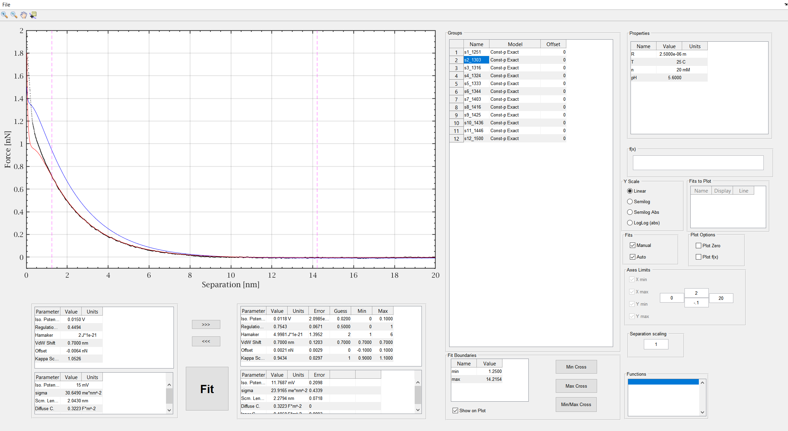

# ForceFit
*ForceFit* is a convenient MATLAB GUIDE software I used to fit force models to force measured by Colloidal AFM during my PhD research. *ForceFit* imports export structs of [CyPloyContact](https://github.com/talobs/CyPlotContact), and optionally a properties struct. *ForceFit* adds a field to the imported struct containing the fit models and the extracted parameters for further analysis. This version ships with three models for colloid-surface interaction:  Exact Constant-p, Linear Constant-p, and DLVO.

## Features
- Fit theoretical force models to experimental data
- Manual fitting - allows to manually set the fitting parameters and examine the result.
- Automatically calculates physical parameters
- Set fit boundaries by typing values or by using the cursor, with optional visual marks.
- Allows to dynamically change force properties such as salt concentration, pH, temperature and colloid radius.
- Allows to globally rescale the separation.
- Plotting scales: Linear, SemilogY, SemilogY Abs (plots the absolute value of y in a SemilogY scale), and Log-Log.
- Easy manual and automatic adjustment of the plot boundaries.
- Offset adjustment.

## Images
